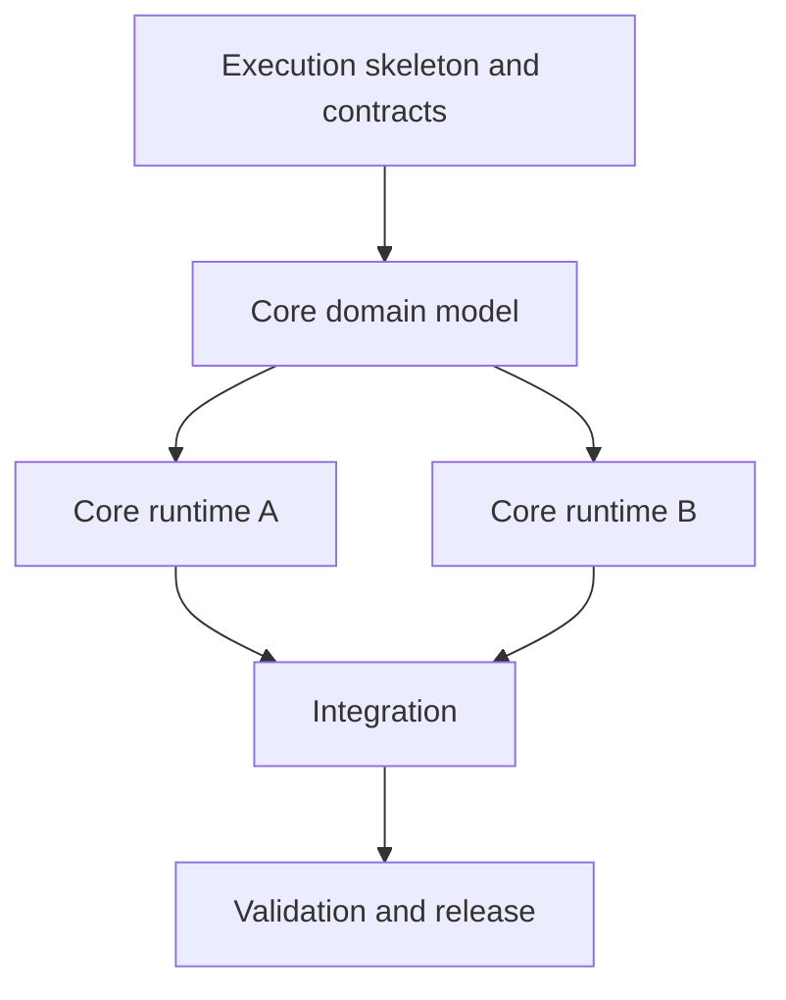

# Implementation Roadmap

Turn the requested implementation goal into a roadmap that a developer can execute.

## Output contract

- Produce only Markdown (`.md`) content and Markdown files.
- Embed every diagram as a fenced Mermaid block. Do not create standalone HTML, SVG, image, viewer, or architecture artifacts.
- Write prose, Mermaid labels, task names, blockers, and pseudocode in the user's language. Preserve product names and necessary code identifiers verbatim.
- When the filesystem is available, create a roadmap directory with an index and one document per phase. Otherwise provide the same structure inline.
- Keep each Markdown document below 500 lines when practical. Split a phase only when it has a distinct implementation outcome or dependency gate.
- Do not implement the product unless the user separately asks for implementation.

## Establish the basis

Read the goal and any provided source, specification, or repository evidence before choosing phases.

- Treat existing source code and tests as authoritative when a repository is in scope.
- Reuse existing project layers, naming, utilities, and test patterns instead of inventing a parallel structure.
- If the technology stack is unspecified, make the roadmap stack-neutral and state that assumption. Do not block on a choice that does not change the implementation order.
- Separate observed requirements from assumptions and unknowns. Unknown rules become blockers or configurable data, never invented constants.
- Keep security, validation, accessibility, persistence, and data-loss prevention when relevant; do not simplify them away.

## Design the phase tree

Choose the fewest phases that produce independently verifiable increments. Five to eight phases is a useful range, not a quota.

Use this dependency shape when it fits:



Adapt labels and branches to the user's domain. Parallelize only genuinely independent work. Put shared contracts and data models before their consumers, and put integration after all required branches.

## Index document

The roadmap index must contain:

1. Implementation objective, scope, exclusions, and assumptions.
2. A Mermaid phase dependency graph.
3. A phase summary table with outcome, dependencies, and primary blocker.
4. A Mermaid system/component flow showing the intended implementation boundaries.
5. Common Definition of Done.
6. Links to every phase document.

Use a relative link for each phase when writing files.

## Todo status and tree format

Write phase task lists and implementation order as a nested Markdown checkbox todo tree with phases, tasks, and subtasks. Mark each node with exactly one of these statuses:

```markdown
- [ ] [Not started] Phase 1: phase definition
  - [ ] [Not started] Task definition
    - [ ] [Not started] Subtask definition
  - [ ] [In progress] Task definition
- [x] [Completed] Phase 2: phase definition
  - [x] [Completed] Task definition
- [ ] [Blocked] Phase 3: phase definition — cannot start; blocker ID and reason
- [ ] [Failed] Phase 4: phase definition — attempted but failed; result and retry condition
```

Indented child nodes represent work belonging to the parent node. Check only `[Completed]`; leave all other statuses unchecked. Use `[Blocked]` only for a dependency gap that prevents work from starting, and link the blocker ID and reason. Use `[Failed]` only when work was started but its result failed, and record the failure result and retry or exit condition. Do not omit or rename statuses.

## Phase document

Create one Markdown document per phase. Include only sections that help execution, but cover all of these concerns:

- **Implementation goal:** one observable result.
- **Dependencies:** required earlier phases, external inputs, and downstream consumers.
- **Implementation tree:** modules, programs, classes, data, and tasks in a compact tree.
- **Mermaid diagram:** the diagram that best removes ambiguity.
- **Pseudocode:** required for every non-trivial program, class, service, scheduler, parser, state machine, or transaction introduced in the phase.
- **Implementation order:** a dependency-aware Markdown todo list containing a phase-task-subtask tree and the status of every node.
- **Minimal verification:** the smallest runnable checks that prove the phase.
- **Blockers:** blocker ID, impact or temporary handling, and exact unblocking condition.
- **Exit criteria:** an objective gate for starting dependent phases.

Do not duplicate the same rule across phase documents. Give each rule one owner and link to it elsewhere.

## Mermaid selection

Use the smallest diagram that answers the question:

- `flowchart`: architecture boundaries, dependencies, decisions, and processing flow.
- `sequenceDiagram`: calls, transactions, async work, and user-to-system interactions.
- `stateDiagram-v2`: lifecycle, ownership, status, retries, and recovery.
- `classDiagram`: programs, classes, data ownership, and important relationships.

Prefer one or two focused diagrams per phase. Keep node labels short, use a single obvious main path, and avoid decorative diagrams that repeat the prose.

## Pseudocode rules

Pseudocode is explanatory, not executable source code.

- Use the user's language for control flow, method actions, variables, results, and failure reasons.
- Use natural terms such as the user's equivalents of “if”, “for each”, “while”, “return”, “reject”, and “stop”.
- Preserve a class or product identifier when it helps map the pseudocode to a Mermaid class or a real codebase.
- Show validation before mutation, a single commit point, failure behavior, and emitted results where relevant.
- Prefer one short happy path with its decisive failure branches over exhaustive syntax.

Example:

```text
Class AcquisitionService:
    Confirm(request_id):
        request = find request_id in pending requests
        if missing, stop

        cost_reservation = inventory.reserve(request.cost)
        if cost_reservation is rejected:
            return failure("Insufficient cost")

        transfer ownership
        confirm cost_reservation
        return success
```

Translate the structure rather than copying these words when the user writes in another language.

## Blockers and uncertainty

A blocker must describe a real dependency gap, not ordinary remaining work.

For each blocker record:

- stable ID;
- what cannot be completed or verified;
- safe temporary behavior, if one exists;
- the evidence, decision, or experiment that resolves it.

If a blocker does not prevent the next safe increment, continue the roadmap and make the limitation visible.

## Final validation

Before handoff, verify:

- every phase document is Markdown and below the recommended line limit;
- all relative Markdown links resolve;
- every phase has dependencies, blockers, minimal verification, and exit criteria;
- every non-trivial program or class has pseudocode in the user's language;
- every task list is a phase-task-subtask checkbox tree and uses one of the five allowed statuses;
- Mermaid fences are balanced and diagram types fit their purpose;
- phase dependencies have no accidental cycle;
- the roadmap contains no standalone diagram artifact or unrequested implementation.

Lead the handoff with the index document and briefly report validation results.
